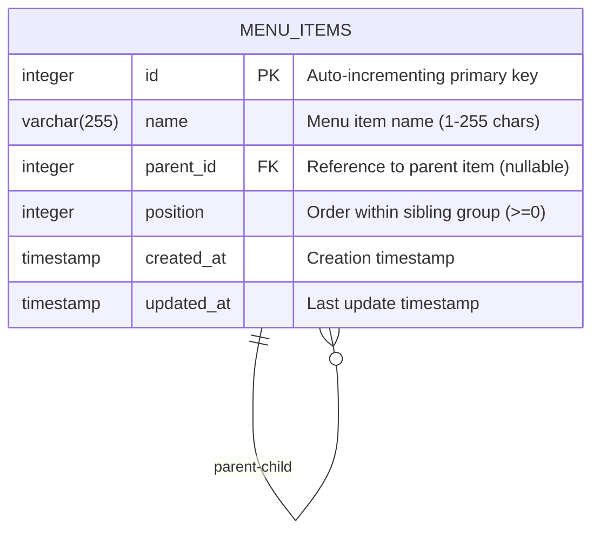

# Database Schema Documentation

## Entity Relationship Diagram



## Schema Structure

### Table: menu_items

```sql
CREATE TABLE menu_items (
    id SERIAL PRIMARY KEY,
    name VARCHAR(255) NOT NULL,
    parent_id INTEGER NULL,
    position INTEGER NOT NULL DEFAULT 0,
    created_at TIMESTAMP NOT NULL DEFAULT CURRENT_TIMESTAMP,
    updated_at TIMESTAMP NOT NULL DEFAULT CURRENT_TIMESTAMP,
    
    CONSTRAINT fk_parent FOREIGN KEY (parent_id) 
        REFERENCES menu_items(id) ON DELETE CASCADE,
    CONSTRAINT chk_name_length CHECK (LENGTH(name) > 0 AND LENGTH(name) <= 255),
    CONSTRAINT chk_position_non_negative CHECK (position >= 0)
);
```

## Hierarchical Data Model

The schema uses the **Adjacency List Model** for storing hierarchical data:

```
Root Level (parent_id = NULL)
│
├── Menu Item 1 (position=0)
│   ├── Child 1.1 (position=0)
│   │   └── Grandchild 1.1.1 (position=0)
│   └── Child 1.2 (position=1)
│
├── Menu Item 2 (position=1)
│   └── Child 2.1 (position=0)
│
└── Menu Item 3 (position=2)
```

### Example Data

| id | name | parent_id | position |
|----|------|-----------|----------|
| 1 | Home | NULL | 0 |
| 2 | About | NULL | 1 |
| 3 | Services | NULL | 2 |
| 4 | Our Team | 2 | 0 |
| 5 | Our History | 2 | 1 |
| 6 | Management | 4 | 0 |

**Tree Visualization**:
```
Root
├── Home (id=1, pos=0)
├── About (id=2, pos=1)
│   ├── Our Team (id=4, pos=0)
│   │   └── Management (id=6, pos=0)
│   └── Our History (id=5, pos=1)
└── Services (id=3, pos=2)
```

## Indexes

### 1. Primary Key Index
```sql
-- Automatically created with SERIAL PRIMARY KEY
-- Name: menu_items_pkey
-- Type: B-tree
-- Columns: (id)
```

### 2. Parent ID Index
```sql
CREATE INDEX idx_parent_id ON menu_items(parent_id);
-- Purpose: Optimize queries filtering by parent
-- Used by: SELECT * FROM menu_items WHERE parent_id = ?
```

### 3. Position Index
```sql
CREATE INDEX idx_position ON menu_items(position);
-- Purpose: Optimize queries ordering by position
-- Used by: SELECT * FROM menu_items ORDER BY position
```

### 4. Composite Parent-Position Index
```sql
CREATE INDEX idx_parent_position ON menu_items(parent_id, position);
-- Purpose: Optimize fetching siblings in order
-- Used by: SELECT * FROM menu_items WHERE parent_id = ? ORDER BY position
```

## Constraints

### Primary Key
```sql
id SERIAL PRIMARY KEY
```
- Ensures uniqueness of menu items
- Auto-incrementing integer values

### Foreign Key (Self-Referencing)
```sql
CONSTRAINT fk_parent FOREIGN KEY (parent_id) 
    REFERENCES menu_items(id) ON DELETE CASCADE
```
- Ensures parent_id references valid menu item
- **CASCADE DELETE**: When parent is deleted, all descendants are automatically deleted
- Prevents orphaned menu items

### Check Constraints

#### Name Length
```sql
CONSTRAINT chk_name_length CHECK (LENGTH(name) > 0 AND LENGTH(name) <= 255)
```
- Prevents empty menu item names
- Limits name to 255 characters maximum

#### Position Non-Negative
```sql
CONSTRAINT chk_position_non_negative CHECK (position >= 0)
```
- Ensures position is always >= 0
- Prevents negative position values

## Trigger: Auto-Update Timestamp

### Function Definition
```sql
CREATE OR REPLACE FUNCTION update_updated_at_column()
RETURNS TRIGGER AS $$
BEGIN
    NEW.updated_at = CURRENT_TIMESTAMP;
    RETURN NEW;
END;
$$ LANGUAGE plpgsql;
```

### Trigger Definition
```sql
CREATE TRIGGER update_menu_items_updated_at
    BEFORE UPDATE ON menu_items
    FOR EACH ROW
    EXECUTE FUNCTION update_updated_at_column();
```

**Behavior**:
- Automatically sets `updated_at` to current timestamp on every UPDATE
- Executes BEFORE the update is committed
- No application-level logic required

## Common Queries

### 1. Get All Root-Level Items
```sql
SELECT * FROM menu_items 
WHERE parent_id IS NULL 
ORDER BY position;
```

### 2. Get All Children of a Parent
```sql
SELECT * FROM menu_items 
WHERE parent_id = ? 
ORDER BY position;
```

### 3. Get Entire Subtree (Recursive)
```sql
WITH RECURSIVE subtree AS (
    -- Base case: the root node
    SELECT id, name, parent_id, position, 0 as depth
    FROM menu_items
    WHERE id = ?
    
    UNION ALL
    
    -- Recursive case: children
    SELECT mi.id, mi.name, mi.parent_id, mi.position, st.depth + 1
    FROM menu_items mi
    INNER JOIN subtree st ON mi.parent_id = st.id
)
SELECT * FROM subtree ORDER BY depth, position;
```

### 4. Get All Ancestors (Path to Root)
```sql
WITH RECURSIVE ancestors AS (
    -- Base case: the node itself
    SELECT id, name, parent_id, position
    FROM menu_items
    WHERE id = ?
    
    UNION ALL
    
    -- Recursive case: parent
    SELECT mi.id, mi.name, mi.parent_id, mi.position
    FROM menu_items mi
    INNER JOIN ancestors a ON mi.id = a.parent_id
)
SELECT * FROM ancestors WHERE id != ?;
```

### 5. Get All Descendants (IDs only, for validation)
```sql
WITH RECURSIVE descendants AS (
    -- Base case: the node itself
    SELECT id, parent_id
    FROM menu_items
    WHERE id = ?
    
    UNION ALL
    
    -- Recursive case: children
    SELECT mi.id, mi.parent_id
    FROM menu_items mi
    INNER JOIN descendants d ON mi.parent_id = d.id
)
SELECT id FROM descendants WHERE id != ?;
```

### 6. Reorder Menu Item (Update Positions)
```sql
-- Example: Move item from position 1 to position 3
-- Step 1: Decrement positions between old and new position
UPDATE menu_items 
SET position = position - 1 
WHERE parent_id = ? AND position > 1 AND position <= 3;

-- Step 2: Set new position
UPDATE menu_items 
SET position = 3 
WHERE id = ?;
```

### 7. Move Menu Item to Different Parent
```sql
-- Step 1: Remove from old parent (decrement positions)
UPDATE menu_items 
SET position = position - 1 
WHERE parent_id = ? AND position > ?;

-- Step 2: Insert at new parent (increment positions to make space)
UPDATE menu_items 
SET position = position + 1 
WHERE parent_id = ? AND position >= ?;

-- Step 3: Update the moved item
UPDATE menu_items 
SET parent_id = ?, position = ? 
WHERE id = ?;
```

## Performance Characteristics

### Adjacency List Model

**Strengths**:
- ✓ O(1) INSERT operations
- ✓ O(1) UPDATE operations (single item)
- ✓ O(1) DELETE operations (single item)
- ✓ O(k) fetching immediate children (k = number of children)
- ✓ Simple to understand and maintain
- ✓ Excellent for frequent write operations

**Weaknesses**:
- ✗ O(n) for subtree operations (requires recursive query)
- ✗ O(d) for depth calculation (d = depth of tree)
- ✗ Multiple queries needed for path operations

**When to Use**:
- ✓ Frequent CRUD operations
- ✓ Drag-and-drop reordering
- ✓ User-driven menu management
- ✓ Shallow to medium depth trees (< 10 levels)

**Alternative Models**:
- **Nested Sets**: Better for read-heavy workloads, worse for writes
- **Materialized Path**: Better for path queries, more storage overhead
- **Closure Table**: Better for complex queries, requires additional table

## Data Integrity Rules

1. **No Orphaned Nodes**: Foreign key with CASCADE ensures deleted parents remove all descendants
2. **Valid Parent References**: Foreign key ensures parent_id always references existing item
3. **Non-Empty Names**: CHECK constraint prevents empty strings
4. **Non-Negative Positions**: CHECK constraint ensures positions are >= 0
5. **Automatic Timestamps**: Trigger ensures updated_at is always current

## Circular Reference Prevention

The application must implement logic to prevent circular references:

```
Cannot move item A to be a child of item B if:
- B is A
- B is a descendant of A
```

**Implementation**:
1. Query all descendants of A using recursive CTE
2. Check if B is in the descendant list
3. Reject move operation if circular reference detected

## Migration History

| Version | Date | Description | Requirements |
|---------|------|-------------|--------------|
| 001 | 2024 | Initial schema: menu_items table with adjacency list model, indexes, constraints, and updated_at trigger | 13.1-13.6 |

## Backup and Recovery

### Backup Database
```bash
pg_dump -U postgres -d menu_system_db > backup_$(date +%Y%m%d).sql
```

### Restore Database
```bash
psql -U postgres -d menu_system_db < backup_20240101.sql
```

### Backup Table Only
```bash
pg_dump -U postgres -d menu_system_db -t menu_items > menu_items_backup.sql
```

## Security Considerations

1. **SQL Injection Prevention**: Use parameterized queries in application code
2. **Access Control**: Grant minimum required privileges to application user
3. **Connection Security**: Use SSL/TLS for database connections in production
4. **Password Management**: Store database credentials securely (environment variables, secrets manager)

### Recommended User Permissions

```sql
-- Create application user
CREATE USER menu_app WITH PASSWORD 'secure_password';

-- Grant minimal permissions
GRANT CONNECT ON DATABASE menu_system_db TO menu_app;
GRANT SELECT, INSERT, UPDATE, DELETE ON menu_items TO menu_app;
GRANT USAGE, SELECT ON SEQUENCE menu_items_id_seq TO menu_app;
```

## Testing Strategy

1. **Unit Tests**: Test individual constraints and triggers
2. **Integration Tests**: Test recursive queries and cascade operations
3. **Performance Tests**: Test query performance with large datasets (1000+ items)
4. **Load Tests**: Test concurrent operations and transaction isolation

## Monitoring

### Key Metrics to Monitor

1. **Query Performance**:
   ```sql
   -- Enable query statistics
   SELECT * FROM pg_stat_statements WHERE query LIKE '%menu_items%';
   ```

2. **Index Usage**:
   ```sql
   -- Check index usage
   SELECT * FROM pg_stat_user_indexes WHERE relname = 'menu_items';
   ```

3. **Table Size**:
   ```sql
   -- Check table size
   SELECT pg_size_pretty(pg_total_relation_size('menu_items'));
   ```

4. **Lock Contention**:
   ```sql
   -- Monitor locks
   SELECT * FROM pg_locks WHERE relation::regclass::text = 'menu_items';
   ```

## References

- [PostgreSQL SERIAL Type](https://www.postgresql.org/docs/current/datatype-numeric.html#DATATYPE-SERIAL)
- [PostgreSQL Recursive Queries](https://www.postgresql.org/docs/current/queries-with.html)
- [PostgreSQL Triggers](https://www.postgresql.org/docs/current/trigger-definition.html)
- [PostgreSQL Indexes](https://www.postgresql.org/docs/current/indexes.html)
- [Adjacency List Model](https://en.wikipedia.org/wiki/Adjacency_list)
